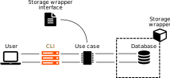
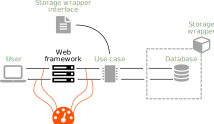

# Flusso dei dati

La Clean Architecture si basa sui cosiddetti _Design Pattern_. I design pattern non sono altro che codici scritti seguendo regole precise atti a risolvere determinati problemi di sviluppo. Non andremo ad analizzare essi in quanto non è il focus di questo documento. Ci interessa maggiormente comprendere alcuni concetti che ci permettono di implementare la clean architecture. Detto ciò quindi, parliamo del flusso dei dati.

### Esempio pratico

Il libro di riferimento ci introduce i concetti base ed il flusso dei dati con un semplice esempio.

Immaginiamo di avere un URL accessibile da browser: `/rooms?status=available`. Quando un utente accede a questo URL, effettua una richiesta HTTP al nostro sistema. Questo componente del sistema che riceve la richiesta dell'utente lo possiamo chiamare **web framework**.

Il componente web framework dovrà occuparsi quindi di comprendere cosa l'utente chiede. Possiamo immaginare che l'utente si aspetti di avere come risposta una lista di stanze le quali non sono occupate, come possiamo dedurre dell'endpoint `/rooms` e dalla query `status=available`.

Il web framework non fa altro. Ad elaborare la richiesta fatta dall'utente ci penserà un altro componente, ovvero quel componente che ha come scopo trovare tutte le stanze disponibili. Quindi questo nuovo componente riceverà le informazioni necessarie dal web framework, elaborerà la richiesta e restituirà la risposta desiderata.

Questo componente è chiamato **use case**.

L'insieme di tutti gli use case definisce le logiche del nostro sistema, da cui derivano le **business logic**. Un caso d'uso del nostro sistema sono le stanze disponibili, ma possiamo immaginare altri casi d'uso come la prenotazione di una di queste stanze o il pagamento di essa.

Questo è il primo concetto importante da comprendere per la Clean Architecture, le business logic:


**Business logic**

Le business logic sono algoritmi o processi specifici atti a risolvere determinati casi d'uso. È il modo di trasformare dei semplici dati in un servizio che vogliamo fornire. La business logic è il componente fondamentale dell'architettura pulita


Il motivo per cui è necessario dividere i web framework e le business logic è essenzialmente la divisione dei compiti, ovvero dividere i componenti in base alle responsabilità e al dominio del nostro sistema. Questo è il secondo concetto fondamentale da comprendere sulla Clean Architecture.


**Separation of concerns**

Differenti parti del sistema dovrebbero gestire differenti parti del processo. Il motivo principale di questa suddivisione è la gestione del codice. Più i componenti sono accoppiati tra loro, ovvero più i componenti lavorano con gli stessi dati o processi, più sarà difficile cambiare il codice senza influenzare altre parti di esso


Ora, tornando all'esempio, possiamo dire con certezza che il nostro sistema avrà un qualche tipo di archiviazione dei dati necessari per fornire il servizio. Probabilmente tu che stai leggendo, e io in primis, avrai pensato immediatamente ad una qualche tipologia di database, relazionale, non relazionale o altro. Abbiamo pensato ad un specifico database e quindi avremmo fatto uno schema del genere:

La scelta di un singolo database, come MySQL, Postgres, etc, è un'enorme vincolo per il nostro sviluppo. Infatti, sviluppando il nostro servizio sulla base di un singolo mezzo di archiviazione, ci limiterebbe in un futuro tantissime strade. Potremmo aver bisogno di un database differente o addirittura constatare che un database è eccessivo come sistema di archiviazione e concludere che basterebbe un semplice file per salvare i nostri dati.

Questa semplice analisi che abbiamo fatto è alla base del terzo concetto fondamentale, ovvero l'astrazione. Martin diceva che bisognerebbe evitare qualsiasi decisione, in modo da tenere aperte tutte le possibili strade per lo sviluppo, senza vincolarci a determinate decisioni.


**Abstraction**

La progettazione di un sistema deve essere pensata in termini di astrazione, di blocchi. Un singolo componente ha regole operative specifiche che lo definiscono. Più è alto il livello di astrazione, più il componente è poco dettagliato. Ovviamente un componente di questo livello non potrà risolvere completamente un problema pratico, esso dovrà avere componenti di livello più basso, più dettagliato, che implementi le regole per risolverlo


Una buona regola di progettazione del software è fare dipendere i componenti di più basso livello di astrazione da quelli di più alto livello. Questo perché più il componente è di alto livello di astrazione, più il componente è stabile ovvero che verrà modificato raramente. Al contrario, più il livello del componente è basso, più risulterà instabile.

Nell'esempio portato avanti fino ad adesso, ci verrebbe da creare una dipendenza a partire dal caso d'uso per arrivare al database. Questo però è sbagliato, non è una buona pratica nella clean architecture. Infatti il database è un componente più specifico, meno astratto, quindi sarà esso a dipendere dal caso d'uso e non il contrario.


**Implementation detail**

Dall'astrazione deriva immediatamente il concetto di implementazione di dettaglio. Come abbiamo detto, un componente astratto sarà per definizione poco dettagliato, il che lo rende poco utile preso singolarmente. Esso è utile invece per implementare dei componenti di dettaglio, i quali risolvono problemi specifici


Ma la domanda sorge spontanea, come facciamo a rendere i componenti poco accoppiati tra loco? Attraverso l'inversione del controllo.

Se noi all'interno del nostro caso d'uso creassimo un'istanza del nostro database, allora avremmo i due componenti altamente accoppiati, oltre che una violazione della regola di astrazione. Dobbiamo quindi cercare di invertire il flusso di controllo. Per fare ciò si utilizzano le **interfacce**. Le interfacce sono molto utili in quanto sono componenti di alta astrazione, non definiscono logiche ma solamente quali sono i comportamenti che i componenti di dettaglio devono svolgere, i quali varieranno dal dettaglio stesso.

Possiamo quindi immaginare un'interfaccia di storage che definisca i metodi per salvare i nostri dati, i quali verranno implementati nel dettaglio in base a quale sistema di storage decidiamo di utilizzare. Il caso d'uso accetterà come parametro del costruttore un oggetto figlio dell'interfaccia. Facendo ciò il caso d'uso si limita ad utilizzare i metodi forniti dall'interfaccia, che verranno poi eseguiti in base all'oggetto di dettaglio passato.

Con ciò il caso d'uso non dipenderà dai dettagli di un componente di più basso livello. Nel caso le logiche di implementazione di questo componente dovessero cambiare non influenzano il caso d'uso, dato che si interfaccia ad essi attraverso una interfaccia astratta, facendo in modo di invertire il flusso di controllo.

A questo punto il flusso del nostro sistema è il seguente.

1. L'utente richiede la lista delle stanze disponibili attraverso il web framework
2. Il web framework chiama il relativo caso d'uso che ne elabora la richiesta
3. Il caso d'uso ottiene la lista delle stanze disponibili attraverso l'interfaccia di archiviazione

Quello che rimane da fare è restituire al nostro utente i risultati della sua richiesta. Quindi il caso d'uso passerà questa lista al web framework, il quale la restituirà al nostro utente attraverso una pagina HTML o API.

Il nostro sistema ora è funzionante, mantenibile e estensibile con uno sforzo minimo, riducendo drasticamente costi e tempi di sviluppo.

### Vantaggi dell'architettura a layer

Questo sistema che abbiamo creato grazie all'esempio è un'architettura molto efficiente. Infatti ci basterà un minimo sforzo per evolvere il nostro sistema in base alle esigenze che potranno mostrarsi nel tempo.

Possiamo immaginare che in un futuro il nostro sistema non debba più essere fornito attraverso il web, ma piuttosto attraverso riga di comando in locale. Quello che ci basterà fare è creare un componente **CLI** che sostituisca il componente web framework e il nostro sistema risulterà già pronto per essere utilizzato.

Analogamente, possiamo notare che il componente database è sotto utilizzato rispetto alle sue potenzialità e quindi per ridurre i costi di mantenimento potremmo giungere alla conclusione di sostituire l'archiviazione attraverso database con una tipologia di archiviazione sotto forma di **file testuale**. Per effettuare questa modifica ci basta implementare un nuovo componente di dettaglio per il file testuale e sostituirlo al componente database, il quale verrà ancora interrogato attraverso la stessa interfaccia storage precedentemente sviluppata.

Un altro vantaggio molto importante che porta questa architettura è la testabilità. Dato che ogni parte del sistema è suddiviso in base allo scopo e risulta disaccoppiato da altri componenti, possiamo idealmente separare ogni singolo componente dal sistema per effettuare test su di esso.&#x20;

Immaginiamo di voler testare il componente web framework:

Per testarlo non ci serve aver implementato tutti i casi d'uso di cui fa utilizzo, ci basta sapere quali sono gli input che riceve e quali sono gli output attesi per verificarne il corretto comportamento.

Sappiamo che il componente web framework riceve in input delle richieste HTTP, con specifici endpoint e query. Successivamente esso invocherà un caso d'uso finto, che non fa altro che ritornare il risultato atteso rispetto alla richiesta. Una volta ricevuto questo risultato dal caso d'uso finto, il web framework passerà il risultato al nostro test. Se l'output che otteniamo è quello atteso, allora possiamo considerare il comportamento del componente corretto.

Questo procedimento di test è possibile svolgerlo per qualsiasi componente del sistema. Ciò rende questa architettura molto testabile, oltre che estensibile e mantenibile.
